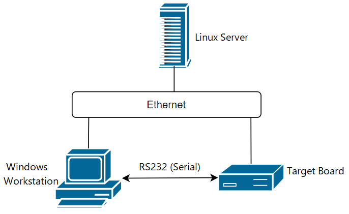
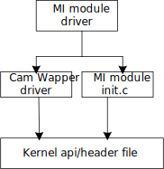

# 开发环境搭建

## 1. 开发环境

### 1.1. 开发环境说明

由于嵌入式单板的资源有限，不能在单板上运行开发和调试工具，通常需要交叉编译调试的方式进行开发和调试，即“宿主机＋目标板”的形式。一般情况下宿主机和目标板的处理器架构不相同。宿主机需要建立适合于目标板的交叉编译环境。程序在宿主机上经过“编译－连接－定位”得到可执行文件。将可执行文件烧写到目标板中，然后在目标板上运行，下面以一种典型的开发环境为例进行说明。

iford 的开发环境通常包括 Linux服务器、Windows工作台（宿主机）和EVB（目标板），三者处于同一个网络中，<b>如图1-1所示</b>

> 目标板上的Bootloader（IPL+uboot）启动后，目标板中的操作信息通过串口输出到宿主机上显示。在宿主机上的控制台中输入命令，可以控制目标机。
>
> 在Linux服务器上建立交叉编译环境，Windows 工作台通过串口与demo单板连接，开发人员可以在Windows工作台中进行程序开发或者远程登录到Linux服务器进行程序开发。各部分具体软件介绍<b>如表1-1所示</b>。

<b>图1-1 嵌入式开发图示</b>



<b>表1-1 开发环境部分软件描述</b>

| 操作平台       | 操作系统                                      | 软件描述                                                                                                                                           |
| ---------- | ----------------------------------------- | ---------------------------------------------------------------------------------------------------------------------------------------------- |
| Windows工作台 | Windows XP/7/10/11                        | putty（或Xshell/SecureCRT等）、tftp服务器（tftpd32）、SStar ISP工具（Flash_Tool_xxx.exe）                                                                     |
| Linux服务器   | Ubuntu或CentOS。建议使用Ubuntu 18.04及以上版本的完全安装。 | NFS、telnetd、samba、vim、arm 交叉编译环境（Gcc 版本11.1.0 for alkaid/kernel，Gcc 9.1.0 for RTOS，Gcc 10.3 for pmrtos）等。其他应用软件根据具体开发需要而定，通常系统都已默认安装，只要适当配置即可。 |
| EVB        | SStar Linux                               | Linux内核基于Linux标准内核5.10.117版包移植开发，根文件系统基于busybox 1.20.2版本制作而成。含telnetd等Linux常用命令。                                                               |

### 1.2. 搭建开发环境

推荐用户使用64 位Linux 服务器，本开发包在32 位Linux 服务器、较老版本的Linux服务器、偏冷门的Linux 服务器上可能存在未知的兼容性问题。
推荐的硬件配置如下：

- CPU Intel(R) Xeon(R) CPU E5-2450 0 @ 2.10GHz 或更好CPU
- DDR: >= 16GB
- Hard disk >= 600GB
- Gigabit Ethernet
- OS: Ubuntu 18.04 64bit

> 或者 使用相同配置的虚拟机。

#### 1.2.1 发布包使用的Linux Server 版本

cat /proc/version

    Linux version 4.15.0-112-generic (buildd@lcy01-amd64-027) (gcc version 7.5.0 (Ubuntu 7.5.0-3ubuntu1~18.04)) #113-Ubuntu SMP Thu Jul 9 23:41:39 UTC 2020

lsb_release -a

    LSB Version: core-9.20170808ubuntu1-noarch:printing-9.20170808ubuntu1-noarch:security-9.20170808ubuntu1-noarch
    Distributor ID: Ubuntu
    Description: Ubuntu 18.04.5 LTS
    Release: 18.04
    Codename: bionic

#### 1.2.2. 网络环境搭建

请用户自行配置，并安装nfs、samba、ssh等网络组件。

#### 1.2.3. 软件包安装

<b>sudo</b> apt-get install libc6-dev-i386 lib32z1 lib32ncurses5 libuuid1 cmake libncurses5-dev libncursesw5-dev bc xz-utils automake libtool libevdev-dev pkg-config mtd-utils android-tools-fsutils bison flex libssl-dev libmpc-dev squashfs-tools gawk rename

#### 1.2.4. 安装交叉编译工具链

发布包提供了工具链：

for Alkaid/Kernel:

<b>gcc-11.1.0-20210608-sigmastar-glibc-x86_64_arm-linux-gnueabihf.tar.xz</b>

for Rtos:

<b>gcc-sigmastar-9.1.0-2019.11-x86_64_arm-eabi.tar.xz</b>

for PmRtos:

<b>gcc-arm-none-eabi-10.3-2021.10.tar.xz</b>

安装步骤如下：

step1. 新建工具目录：

    sudo mkdir -p /tools/toolchain 或者 sudo mkdir -p /opt/sstar（本文以/tools/toolchain为例）

step2. 解压安装：

    sudo tar -xvf ./gcc-11.1.0-20210608-sigmastar-glibc-x86_64_arm-linux-gnueabihf.tar.xz -C /tools/toolchain
    sudo tar -xvf ./gcc-sigmastar-9.1.0-2019.11-x86_64_arm-eabi.tar.xz  -C /tools/toolchain
    sudo tar -xvf ./gcc-arm-none-eabi-10.3-2021.10.tar.xz  -C /tools/toolchain

step3. 可直接在每次编译时`export` 或 直接添加到`/etc/profile`、`~/.bashrc`等启动脚本位置

例：`export PATH=/tools/toolchain/gcc-sigmastar-9.1.0-2019.11-x86_64_arm-eabi/bin:/tools/toolchain/gcc-arm-none-eabi-10.3-2021.10/bin:/tools/toolchain/gcc-11.1.0-20210608-sigmastar-glibc-x86_64_arm-linux-gnueabihf/bin:$PATH`

### 1.3. 其他配置

#### 1.3.1. 默认shell配置

编译脚本默认使用的是bash，要求系统的默认shell为bash，可通过`ls -la /bin/sh`命令来确认。以最常用的Ubuntu为例，高版本的Ubuntu默认shell为dash，修改方式如下：

    # ls -la /bin/sh
    lrwxrwxrwx 1 root root 4 Jun 15 08:49 /bin/sh -> dash

    # sudo dpkg-reconfigure dash
    #在弹出的界面选择<NO>

    # ls -la /bin/sh
    lrwxrwxrwx 1 root root 4 Jun 15 08:49 /bin/sh -> bash

#### 1.3.2. 设置默认python版本为python2.x

python2与python3的语义有差别，SDK编译脚本使用的是python2的语义，因此需要将系统默认python版本设置为python2.x，修改方式请参考网络上的相关文档，比如使用`update-alternatives`工具来配置。

> <b>注意：mksquashfs ubuntu自带有，若没有，再根据提示安装即可。</b>
>
> 如果使用低版本的Ubuntu，如在Ubuntu 16.04上建议进行更新源的操作，具体操作请参考网络上的相关文档，若不更新可能会导致后续的编译错误。

---

#### 1.3.3. 设置默认awk实现

编译脚本默认使用awk/gawk，系统的awk版本需要为awk/gawk，可通过awk --help和awk --version命令来确认。以Ubuntu为例：

```
# awk --help
Usage: awk [POSIX or GNU style options] -f progfile [--] file ...
Usage: awk [POSIX or GNU style options] [--] 'program' file ...
POSIX options:        GNU long options: (standard)
    -f progfile        --file=progfile
    -F fs            --field-separator=fs
    -v var=val        --assign=var=val
...

# awk --version
GNU Awk 4.1.4, API: 1.1 (GNU MPFR 4.0.1, GNU MP 6.1.2)
Copyright (C) 1989, 1991-2016 Free Software Foundation.
...
```

如果默认awk实现不是awk/gawk，安装gawk，然后修改awk实现为gawk：

```
sudo apt-get install gawk

sudo update-alternatives --config awk
# 选择 gawk 作为默认的 awk 实现
```

## 2. 硬件连接

### 2.1. demo板连接方式（ SSC029A-S01A-A）

电源: DC 12V；调试串口: TTL电平，波特率115200

连接方式：
    将SigmaStar Debug Tool小板Type-A USB口连接至Windows，另一端连接至demo CON2 Debug口，连接方式<b>如图2-1所示</b>
    用网线通过ETH CON6的RJ45网口将demo板连接与Windows连接至同一网段

<b>图2-1 demo板Uart Debug连接图示</b>


<b>图2-2 demo板Sensor连接图示</b>


aov/pir场景为了满足低功耗等场景sensor型号选用SC4336P。

#### 2.1.1. light sensor

<b>图2-3 光敏电阻接线</b>
light sensor光敏电阻电路连接方法请参照原理图。


#### 2.1.2. AOV str场景去掉默认上拉

请确保将JP29跳帽拔掉，使用外部按键SW21触发。当在dualos(PIR)模式软件主动进入poweroff断电模式后，想要重新上电唤醒进入PIR处理状态需要使用外部按键SW21/SW25触发。

<b>图2-4 demo板跳帽按键</b>


#### 2.1.3. spi nand型号

为了支援PIR模式快速启动的需求，故选用支持DTR模式的nand flash。demo板默认flash不能满足速率需求，所以需要替换为WinBond 25N01JW，此款flash支持在80M clk下运行DTR模式。由于此款flash的供电1.8V，所以请替换完flash后按照图示将JP12跳帽切换至1.8V。

<b>图2-5 flash电源</b>


#### 2.1.4. sensor板低功耗修改

为了满足SC4336P睡眠模式下的低功耗需求，需要将sensor板的PWDN脚在睡眠模式时做拉低处理，注意拉低此引脚后SC4336P不再支持I2C读写。因此需要将demo板的控制脚引出连接sensor板的PWDN脚。

<b>图2-6 sensor板修改</b>


<b>图2-7 demo板控制PWDN脚修改</b>


### 2.2. <span id=uboot>开机进入Uboot</span>

若要开机进入uboot，请在purelinux的环境下通过Detect Key开机。

purelinux(AOV)环境与dualos(PIR)环境切换需要在当前环境的终端中进行。

<b>表1-1 环境切换指令表</b>

| 目标环境 | 切换指令                                                                                                                                                                  |
| ---- | --------------------------------------------------------------------------------------------------------------------------------------------------------------------- |
| AOV  | /customer/riu_w 34 00 400<br/>/customer/riu_w 34 04 3<br/>/customer/riu_w 34 05 0<br/>/customer/riu_w 34 30 1<br/>/customer/riu_w 34 32 1<br/>/customer/riu_w 34 00 0 |
| PIR  | /customer/riu_w 34 00 400<br/>/customer/riu_w 34 04 1<br/>/customer/riu_w 34 05 0<br/>/customer/riu_w 34 30 1<br/>/customer/riu_w 34 32 1<br/>/customer/riu_w 34 00 0 |

由于这类功能在IPL实现，这里仅对IPL分类进行介绍。

sstar提供的IPL放置在sdk以下路径：`alkaid\project\board\chip\boot\flash_type\ipl-dualos`

<b>表1-2 不同启动模式IPL差异表</b>

| 名字                                                                                                                                                                                                                                                             | 描述                                                                                  |
| -------------------------------------------------------------------------------------------------------------------------------------------------------------------------------------------------------------------------------------------------------------- | ----------------------------------------------------------------------------------- |
| IPL.iford_nand_dualos.DDR3_2133_NTC2G_QFN128=y.RTOS_MAIN_CORE_ID=1.BOOT_AOV_PIR=y.LOGGING_LEVEL=0.SSTAR_BIST_ENABLE=n.bin  <br/>IPL_CUST.iford_nand_dualos.DDR3_2133_NTC2G_QFN128=y.RTOS_MAIN_CORE_ID=1.BOOT_AOV_PIR=y.LOGGING_LEVEL=0.SSTAR_BIST_ENABLE=n.bin | xxx为IPL配置选项，IPL命名中 **不含有"BOOT_GPIO=y"** 关键字 。默认为长按键盘Enter键进入uboot(需要等待键盘输入，多花费20ms) |

使用方法，以nand flash为例：

在实际的分区表中project\image\configs\general\spinand-ramdisk.rtos.partition.config

ipl$(RESOURCE) = 指定需要的IPL

ipl_cust$(RESOURCE) = 指定需要的IPL_CUST

然后重新make image即可

### 2.3. demo板启动方式设置

AOV/PIR demo board环境默认使用spi nand。

For QFN128 SSC029A-S01A-A:

<b>图2-6 SSC029A-S01A-A demo板SPI NAND启动 跳线帽连接图示</b>


---

## 3. 编译

在SDK中编译有所区分，通过不同的配置文件来实现编译不同的uboot defconfig/kernel defconfig，以及打包成不同类型的文件系统格式。SDK中包含了最新的boot和kernel的sourceCode，SDK的编译过程主要包括：

1. 编译uboot生成uboot image

2. 编译kernel生成kernel image

3. 依赖kernel build环境，将闭源MI模块如xxx.o和xxx_init.c编译链接成xxx.ko和xxx.so

4. 制作分区，打包上述镜像及其余提前编译放置的SDK中的其他binary，生成不同类型的文件系统格式和estar烧录的脚本。

以本芯片支持的SPI NAND/NOR启动方式为例，举例SDK编译方法。

### 3.1. glibc Toolchain配置

    export PATH=/tools/toolchain/gcc-sigmastar-9.1.0-2019.11-x86_64_arm-eabi/bin:/tools/toolchain/gcc-arm-none-eabi-10.3-2021.10/bin:/tools/toolchain/gcc-11.1.0-20210608-sigmastar-glibc-x86_64_arm-linux-gnueabihf/bin:$PATH
    <若1.2.4中已添加至环境变量，则此步骤可省略>

    export CROSS_COMPILE=arm-linux-gnueabihf-

    export ARCH=arm

### 3.2. 编译生成image

解压SourceCode

    cd SourceCode
    tar zxvf xxx.tar.gz

demo板QFN128 DDR3类型板子对应型号为：SSC029A-S01A-A；

**For QFN128 DDR3**:

编译SPINAND：

```
cd project
make ipc-rtos_iford.spinand.glibc-11.1.0-ramdisk.ssc029c.256.qfn128_ddr3_demo_aov_defconfig
make clean;make image -j32
```

<b>从alkaid/project/image/output/images目录可获取烧录所需的所有bin档</b>

> **注意：**
>
> - 切换不同的defconfig编译，需要先执行`make clean`，再执行`make xxx_defconfig`。 **否则可能会执行报错**

### 3.3. defconfig命名说明

编译之前需要选择对应的defconfig，defconfig各字段说明如下：

```
$(PRODUCT).$(FLASH).$(TOOLCHAIN)-$(TOOLCHAIN_VERSION)-$(FS_TYPE).$(BAROD).$(DDR_SIZE).$(PACKAGE)_[$(DDR_TYPE)]_[$(OPTION)]_defconfig
```

| 字段                | 字段说明              | 举例                                                   |
| ----------------- | ----------------- | ---------------------------------------------------- |
| PRODUCT           | 产品形态              | 如：ipc/usbcam/nvr/dispcam/ipc-rtos                    |
| FLASH             | flash类型           | 如：nor/nand/emmc                                      |
| TOOLCHAIN         | 编译链               | 如：glibc/uclibc                                       |
| TOOLCHAIN_VERSION | 编译链版本             | 如：11.1.0/10.2.1                                      |
| FS_TYPE           | 文件系统类型            | 如：ramdisk/ext4fs/ramfs/squashfs                      |
| BAROD             | 板子类型              | 如：ssc029a/ssm00a/ssm00c                              |
| DDR_SIZE          | DDR大小             | 如：256/512x512(两颗512)                                 |
| PACKAGE           | 芯片封装类型            | 如：bga1/bga2/qfn128                                   |
| DDR_TYPE          | DDR类型，此字段为可选字段    | 如：ddr4/ddr3/lpddr3/lpddr4/lpddr4x。如果此字段为空，DDR类型为ddr4 |
| OPTION            | 标识其它一些功能，此字段为可选字段 | 如：hyp/optee/pm_rtos_dram/str                         |

其中DDR_SIZE的含义，以512为例：DDR SIZE 512MB，对应.config文件中的`LX_MEM`的大小：

```
512MB=512*1024*1024Byte=0x20000000Byte
```

同样对应boot下`bootargs`参数中的`LX_MEM=0x20000000`

### 3.4. 单独编译RTOS

进行alkaid整包编译后，如果只修改RTOS部分source code，想要快速编译RTOS进行调试，可以参考以下步骤：

*For QFN128 DDR3**

编译SPINAND：default版本

```
cd rtos/proj
make iford_ssc029c_s01a_256_ipc_lh_spinand_demo_defconfig
make clean;make -j32
```

**编译生成的RTOS bin文件为rtos/proj/build/iford_ssc029xxx_spinand/out/u-iford_ssc029xxx.sz**

默认使用压缩bin档的u-xxx.sz结尾，如要使用未压缩bin档，则使用u-iford_ssc029xxx.bin。

编译完成后，可以在project下面快速打包完整image，以此image进行烧写，image烧写参考下述tftp烧写章节即可：

```
cd project
make image-fast -j32
```

另外可以直接烧写对应的RTOS bin，将编译生成的RTOS bin档，u-iford_ssc029xxx.sz/u-iford_ssc029xxx.bin重命名为RTOS，在uboot下输入命令`estar scripts/[[rtos.es`进行烧写即可。

### 3.5. Linux Config

以 Linux 5.10 为基准，aov/pir架构下请参照以下文件进行配置

```
iford_ssc029c_s01a_lh_spinand_demo_aov_defconfig
```

### 3.6. 编译闭源MI模块说明

Sigmastar SDK里kernel的source code是开源的，为了避免多媒体MI模块代码直接与kernel代码耦合，导致客户开关某些kernel config项需要重新编译MI ko/so，软件采用如下结构：

<center>
    
    <br>
    <div style="color:orange; border-bottom: 1px solid #d9d9d9;
    display: inline-block;
    color: #999;
    padding: 2px">
</center>

其中MI module driver以 xxx.o（如vif.o）形式提供给用户，位于sdk/linux/xxx/目录下；

MI module init.c以xxx_init.c（如vif_init.c）形式提供给用户，位于sdk/linux/xxx/目录下；

Cam wrapper driver位于kernel/drivers/sstar/cam_fs_wrapper/和cam_os_wrapper，最终编译进kenrel image;


当用户对kernel config有重大改动时，按照3.2章节编译project image：

1. make xxx_defconfig 选择对应的project 编译config；

2. make menuconfig，指定kernel编译时使用的客户自己的config;

    <center>
        
        <br>
        <div style="color:orange; border-bottom: 1px solid #d9d9d9;
        display: inline-block;
        color: #999;
        padding: 2px">
    </center>

3. make clean;make image -j32

即可在project\release\chip\iford\$(PRODUCT)\common\$(TOOLCHAIN)\$(TOOLCHAIN_VERSION)\release\modules\5.10\下获取 MI ko。

## 4. 烧写

### 4.1. ISP Tool烧写

请确定 ISP Tool 为<b>5.0.30</b>及以上版本。ISP Tool会在首次版本发布的时候一起打包在tool目录下。

AOV/PIR 场景 demo板默认是用nand flash，故本节仅介绍nand flash烧录方法。

默认的分区配置如下表，在项目开发的过程或者不同的项目上，分区很可能会不同。实际使用的分区请参考编译镜像中的image/partition_layout.txt。

Nand flash 烧录步骤：

step1. 打开ISP tool。<b>并且关闭UART terminal</b>，否则可能无法正常'Connect'。

step2. 选择SPI tab，点击'More' 并且选择类型为'SPINAND'，点击'Domain' 并且选择为'NON-PM'。

step3. 点击'Connect'，加载image "cis.bin"，并点击'Run'

> 注意：cis.bin 必须同时烧0地址和0x20000地址，否则boot会起不来。


step4. 加载image "cis.bin", <b>base shift= 0x20000</b>, 并点击'Run'。


step5. 加载image "boot.bin"，<b>base shift= 0x140000</b>，并点击'Run'。


> <b>注意：如果烧录过程中遇到bad block skip导致烧录失败，可以勾选工具的OpMarkbadBlock，这样工具就不会检查bad block。如果flash真有bad balck，在烧录过程中的verify会报错。</b>


> <b>注意：</b>
>
> - 烧录时。如果勾选了oob，烧录的又不是ecc bin，就会出现很多bad block，这时可以erase整块flash擦除oob。
> - 出厂坏块无法被擦除，flash厂商有做保护。

***为精简以上步骤，alkaid也提供了集成化方式一键烧录上述所有文件，在step3时选择文件OnebinnandBurnImgConfig.cfg进行烧录即可省略之后所有步骤。***

### 4.2. TFTP烧写

**在PC端运行tftp(FTP server)：**

step1. 使用tftp工具指向image path：project\image\output\images\（**或单独拷贝到其他目录**），并选择正确的网卡。


step2. 连接板子的网口到PC端(**与PC同一网段即可**)，连接Debug串口工具到PC端，并检查连接的正确性。

**在板子端运行tftp(FTP Client)：**

step1. 板子开机，长按回车，进入bootloader command line。

首次烧录请设置IP：(除非ip设置变更或者更换flash)

    # set -f gatewayip 192.168.1.1
    # set -f ipaddr 192.168.1.101 (设定FTP Client (板子)使用的IP)
    # set -f netmask 255.255.255.0
    # set -f serverip 192.168.1.100 (设定FTP server (PC) 的IP)
    # saveenv

> 注意：
>
> - 为了保证烧录顺利，请保证PC和开发板处于同一网段；
>
> - 请采用静态方式固定分配ip，防止烧录时ip地址跳变；
>
> - 也可以使用独立网卡使PC端直连开发板，固定该网卡的内网ip地址，并按上述方法设定开发板。

step2. 在UBOOT console下执行`estar`即可自动通过网络烧录。

如果烧录成功，会自动重启进入kernel。

如果烧录失败，简单排查方法：

1. 先检查网络是否能ping通，在uboot下ping serverip，如不能ping 通，先检查网络配置是否有误；

2. 如果可ping通，检查image下`auto_update.txt`文件，该文件为烧录脚本，检查`auto_update.txt`文件里所需烧录的bin文件，image下是否已齐全。

---

## 5. demo板软件运行演示

按照本文档前几节方式配置好开发环境和image成功烧录后，我们可以默认进入到purelinux(aov)环境的终端控制台了，并且演示所需的app以及依赖文件已经默认安装到了其对应目录。接下来的运行步骤可以参照[环境配置及运行](Readme.md#demoenv)。
