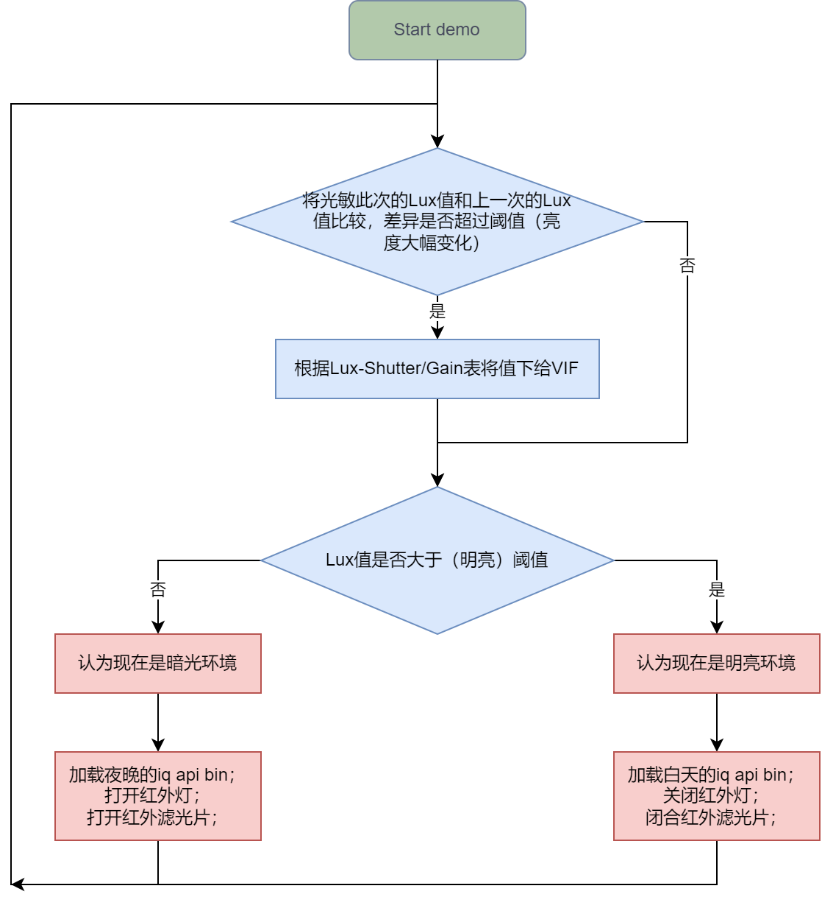

# AOV说明文档

---


## 一、简介


### 1. 背景介绍

AOV（Always On Video）是一种视频监控方案，旨在实现全天候、持续不断的录像，而不会中断或耗费过多电力。这种场景通常用于户外环境，例如景区、乡村、农牧、林业、养殖等地方，这些地区可能没有电网供电或网络连接。在这些环境中，传统的监控方案需要经常更换电池或者接入电源，增加了维护成本和人力成本，因此，AOV产品的出现填补了这一领域的需求空白。


### 2. 工作原理

白天，摄像头通过太阳能充电，将电能存储在智能电池中，晚上或阴雨天气通过蓄电池供电，以确保全年持续供电，而不需要外部电源。同时，该产品通过休眠/唤醒动作来达到极低功耗，通过PIR/IPU实现人形识别功能。能够在不间断供电的情况下对环境进行持续监控，为户外监控提供了更加便捷、可靠的解决方案。


### 3. demo pipe

- **正常电量模式demo**

  * 单sensor
  ```
                                                     ring mode   +-------+
                                                    +----------->+ VENC  |
                                                    |            +-------+
  +-------+  realtime  +-------+  realtime  +-------+
  |  VIF  +----------->+  ISP  +----------->+  SCL  |
  +-------+            +-------+            +-------+
                                                    |user inject +-------+
                                                    +----------->+  IPU  |
                                                                 +-------+
  ```

  vif、isp、scl三个模块realtime mode绑定，scl和venc以ring mode的方式连接，scl和ipu以user inject的方式连接。

  * 双sensor
  ```
            FrameMode           Realtime            RingMode
  +-------+ Group 0   +-------+ Dev 0     +-------+ Dev 0      +-------+ Dev 0
  |  VIF  +---------->+  ISP  +---------->+  SCL  +----------->+ VENC  | Chn 0
  +-------+ Dev 0     +-------+ Chn 0     +-------+ Chn 0      +-------+ Port 0
            Port 0              Port 0            | Port 0
                                                  |
                                                  |
                                                  |user inject +-------+
                                                  +----------->+  IPU  |
                                                               +-------+

            FrameMode           Realtime            RingMode
  +-------+ Group 1   +-------+ Dev 0     +-------+ Dev 0      +-------+ Dev 0
  |  VIF  +---------->+  ISP  +---------->+  SCL  +----------->+ VENC  | Chn 1
  +-------+ Dev 4     +-------+ Chn 1     +-------+ Chn 1      +-------+ Port 0
            Port 0              Port 0              Port 0
  ```

  vif和isp以frame mode方式绑定、isp和scl以realtime mode方式绑定，scl和venc以ring mode的方式连接，scl和ipu以user inject的方式连接。


- **低电量模式demo**

  ```
                                                      ring mode  +-------+
                                                    +----------->+ VENC  |
                                                    |            +-------+
  +-------+  realtime  +-------+  realtime  +-------+
  |  VIF  +----------->+  ISP  +----------->+  SCL  |
  +-------+            +-------+            +-------+
                                                    |user inject +-------+
                                                    +----------->+  IPU  |
                                                                 +-------+
  ```

  vif、isp、scl三个模块realtime mode绑定，scl和venc以framemode绑定，scl和ipu以user inject的方式连接。

  * 双sensor
  ```
            FrameMode           Realtime            RingMode
  +-------+ Group 0   +-------+ Dev 0     +-------+ Dev 0      +-------+ Dev 0
  |  VIF  +---------->+  ISP  +---------->+  SCL  +----------->+ VENC  | Chn 0
  +-------+ Dev 0     +-------+ Chn 0     +-------+ Chn 0      +-------+ Port 0
            Port 0              Port 0            | Port 0
                                                  |
                                                  |
                                                  |user inject +-------+
                                                  +----------->+  IPU  |
                                                               +-------+

            FrameMode           Realtime            RingMode
  +-------+ Group 1   +-------+ Dev 0     +-------+ Dev 0      +-------+ Dev 0
  |  VIF  +---------->+  ISP  +---------->+  SCL  +----------->+ VENC  | Chn 1
  +-------+ Dev 4     +-------+ Chn 1     +-------+ Chn 1      +-------+ Port 0
            Port 0              Port 0              Port 0
  ```

  vif和isp以frame mode方式绑定、isp和scl以realtime mode方式绑定，scl和venc以ring mode的方式连接，scl和ipu以user inject的方式连接。


### 4. 术语介绍

- **工作模式**
  - 正常电量模式 ：在蓄电池电量充足的情况下，设备会以低帧率持续录像，直到检测到人形目标，或者有PIR触发、用户预览触发。
  - 低电量模式：在蓄电池电量较低的情况下，设备可以切换到低电量模式，在该模式下，系统会断电，只保留PIR传感器供电，直到有PIR触发或用户预览触发。
- **唤醒方式**
  - 内部定时器唤醒：在进入休眠状态前，用户配置好alarm，待设备休眠时，等待此alarm唤醒自己。
  - 用户预览唤醒：当用户接入网络时，WiFi模块可以使能设备的用户预览引脚，此时设备被唤醒，将以高帧率运行，发送数据到远端，以供用户预览。
  - PIR唤醒：PIR作为人体红外传感器，可以对人形进行粗略的检测，PIR唤醒设备后，将以高帧率运行，系统会用更准确的IPU进行再次确认。


### 5. 低电量模式的启动

```


                                        +-----------------------------------------------------------+
                                        |                                                           |
                                        |                                                           |
+--------------+    +---------------+   v    +-----------------+      +-------------------------+   |
|  RTOS start  +--->+  Create pipe  +---+--->+  IPU detection  +----->+  Record current status  +---+
+--------------+    +---------------+        +-----------------+      +-------------------------+
                                                                                    ^ |
                                                                                    | |
+----------------------------------------------------------------------------------------------------------------->
                                                                                    | |
                                                                                    | v
       +------------------+                      +-------------------------------------+    +--------------------+
       |  Linux OS start  +--------------------->+  Get the detection results of RTOS  +--->+  Other processing  |
       +------------------+                      +-------------------------------------+    +--------------------+
```

- 低电量模式中，被唤醒后，RTOS会先行启功并快速创建pipe，进行IPU分析，同时Linux系统被加载启动
- Linux系统启动后会再运行一个demo（详见[低电量模式](###2. 低电量模式)），此demo可与RTOS进行信息交互，后续的处理可参考[工作流程](##二、 工作流程)


## 二、 工作流程


AOV的唤醒方式、工作模式之间的切换，如下图所示：


## 三、<span id=demoenv>环境配置及运行</span>


- ### 编译环境说明

  在project路径下选择deconfig进行整包编译，以`SSZ029C-S01A-A`型号板子为例，使用以下deconfig：`ipc-rtos_iford.nor.uclibc-9.1.0-ramdisk.ssz029c.128.qfn128_ddr3_demo_aov_defconfig`。在project目录执行以下命令进行编译：`make ipc-rtos_iford.nor.uclibc-9.1.0-ramdisk.ssz029c.128.qfn128_ddr3_demo_aov_defconfig;`
  `make clean && make image -j8`


- ### 运行环境说明

  * dts配置：

    已默认配置好，无要求

  * sensor驱动配置：

    默认已加载好sc4336p_mipi.ko，无需修改

  * 控灯驱动配置：

    默认已加载好light_misc_control.ko，无需修改


### 1. 正常电量模式

1. 依赖的资源文件

   - demo bin文件：

     - 使用上例给出的deconfig整包编译烧录后，demo会默认打包至板端`/customer/sample_code/bin/prog_aov_aov_demo`路径。
     - 若想手动编译demo，可进到sample_code目录执行 `make clean && make source/iford/aov/aov_demo`进行编译。到`sample_code/out/arm/app/prog_aov_aov_demo`获取可执行文件

   - IPU网络模型：

     - 使用上例给出的deconfig整包编译烧录后，模型会默认打包至板端。
     - 若想更换网络模型，可到`alkaid/project/board/iford/dla_file/ipu_net/det/`路径下获取。

   - IQ bin：

     - 使用上例给出的deconfig整包编译烧录后，IQ bin会默认打包至板端。


2. 运行命令

   - `cd`至`/customer/sample_code/bin`，执行：`./prog_aov_aov_demo`，默认配置：使用sensor的`index 0`、加载网络模型`spdy48.img`、使用IQ bin`sc4336P_api.bin` `/config/iqfile/sc4336P_night_api.bin`，当内存中的码流帧数达到10张后开始写文件、将生成的码流文件，存储在当前目录`./`、不使能audio功能。

     也可自定义指定参数，例如：`./prog_aov_aov_demo index 0 model ./det.img iqbin_b ./low_fps.bin iqbin_d ./night_low_fps.bin dump ./ store 300 -aio ./ ./ao.wav`

     - `index`：用于指定sensor使用的分辨率节点
     - `model`：用于指定IPU网络模型路径
     - `iqbin_b`：用于指定明亮场景使用的IQ bin路径
     - `iqbin_d`：用于指定暗光场景使用的IQ bin路径
     - `store`：用于指定低帧率场景中，内存中存多少张码流后再开始写文件
     - `dump`：用于指定生成的码流文件存储的路径。使用SD卡时，需要先挂载到Linux文件系统
     - `venc`：用于指定venc的编码类型，默认为H264E，可使用`venc h265`指定编码类型为H265E
     - `aux_conv`：用于指定辅助AE收敛的方案，`aux_conv 0`指定使能硬光敏方案，`aux_conv 1`指定为软光敏方案，`aux_conv 2`指定为Fast AE方案
     - `-t`：使能测试模式（用于内部自动化测试）
     - `-d`：使能测试模式（带此参数时，demo不会写文件，直到键入字符"w"，才会退出此模式）
     - `-ai`：用于使能audio的input，并指定录制的音频的存放路径。demo会在高帧率场景期间录制音频
     - `-aio`：用于使能audio的input和output，并指定录制的音频的存放路径、播放的音频文件路径。demo会在高帧率场景期间录制音频和播放音频

   - 运行时，可通过键入不同的字符来模拟不同的事件：

     - 键入字符`c`，可以模拟电量不足的状态
     - 键入字符`d`，可以模拟远端断开连接的状态


3. 退出

   键入字符`q`安全退出demo


### 2. 低电量模式

1. 依赖的资源文件

   - demo bin文件：
     - 使用上例给出的deconfig整包编译烧录后，demo会默认打包至板端`/customer/sample_code/bin/prog_preload_linux`路径。
     - 若想手动编译demo，可进到sample_code目录执行 `make clean && make source/iford/preload/linux`进行编译。到`sample_code/out/arm/app/prog_preload_linux`获取可执行文件
   - IPU网络模型：
     - 使用上例给出的deconfig整包编译烧录后，模型会默认打包至板端`/rofiles/spdy48.img`路径，假如rofiles目录不存在，则会打包到misc目录下。
     - 若想更换网络模型，可到`alkaid/project/board/iford/dla_file/ipu_net/det/`路径下获取。


2. 运行命令

   - `cd`至`/customer/sample_code/bin`，执行：`./prog_preload_linux `，默认：加载网络模型`/rofiles/spdy48.img`、IQ bin`/rofiles/isp_api0.bin`，将生成的码流文件，存储在当前目录`./`。可指定参数：

      - `-h`/`--help`：参数列表说明
      - `dump`：用于指定生成的码流文件存储的路径。使用SD卡时，需要先挂载到Linux文件系统
      - `-t`：使能测试模式（用于内部自动化测试）
      - `-p`：进入RTSP推流模式
      - `-ai`：用于使能audio的input，并指定录制的音频的存放路径。
      - `-aio`：用于使能audio的input和output，并指定录制的音频的存放路径、播放的音频文件路径。


   - 运行时，可通过键入不同的字符来模拟不同的事件：

      - 键入字符`c`，可以模拟电量充足的状态
      - 键入字符`d`，可以模拟远端断开连接的状态


## 四、开发指南


### 1. 正常电量模式流程


1. ##### 整体流程

   


2. ##### 补光策略

   当环境光发生变化时，为了更好的画面效果，可以借助白光灯、红外灯、红外滤光片等来辅助，我们也提供了控制这些外围设备的驱动，详细可参考[Light Misc Control说明文档](aov_demo/kernel/ReadMe.md#lightmisc)。

   在低帧场景中，面对快速变化的环境光时，AE的收敛会比较慢，因此，我们提供了软光敏、硬光敏两种通用方案用于解决这个问题。此外，对于支持Fast AE的sensor，也可以使用Fast AE来辅助收敛，下面也会以os04d10为例介绍Fast AE方案。


   1）、软光敏

   

当处理完一帧画面后，我们可以查询AE的收敛状态，当AE未收敛完成时（即收敛未稳定，bIsStable为false），即可切到高帧去辅助收敛，直至收敛完成（即收敛稳定，bIsStable为true），再根据当前的亮度模式（app自己记录的亮度状态信息，若此前是开着红外灯的，则是暗光模式，若此前是关闭红外灯的，则是亮光模式），判断是否亮转暗，或是暗转亮，若环境有转变，则需要控制开关灯等操作，并再次等待收敛完成，即可回到低帧模式。

需要注意的是，在环境亮暗变化时，此方案会有两次等待AE收敛完成的动作。第一次等待收敛完成是为了确定当前的环境亮度状态（是白天还是夜晚），因为在收敛未完成时（bIsStable为false），判断当前的环境亮度状态的结果可能不准确。第二次等待收敛完成，是因为第一次收敛完成之后有load iqbin、控灯等动作，这些会影响到ISP算法的计算结果。

如下为可能遇到的问题、原因以及对应的解决方案：

   - 问题：在外部环境光剧烈变化时，查询AE的收敛状态，发现其一直在收敛完成和收敛未完成之间跳变。

     - 原因1：AE收敛是否完成，取决于iq api bin里的ConvThdIn/ConvThdOut参数，可能iq api bin里的收敛判定太窄，导致很容易判断为收敛未完成。

       - 解决方案：可以适当调整iq api bin的参数。

     - 原因2：补光灯的帧控模式（此概念可参考[Light Misc Control说明文档](aov_demo/kernel/ReadMe.md#lightmisc)）和常开模式下，sensor曝光的程度不同，导致在补光灯常开模式下收敛完成了，但在帧控模式下又跳变成收敛未完成。

       - 解决方案1：调整帧控制模式下开灯的时机，让其和sensor的曝光时间间隔长一点。

       - 解决方案2：确认硬件补光灯从上电到完全亮起的时间，看是否过长，导致sensor已经开始曝光了，补光灯还没完全亮起。

       - 解决方案3：调整补光灯和sensor的相对位置，使补光灯能覆盖住sensor的视野范围。


   2）、硬光敏

   

设备起来时，读取硬光敏感光拿到的lux值，当和上一次lux值相差超过阈值时，则根据lux-shutter/gain表将对应的shutter/gain下进去，并根据获取到的lux值判断当前环境光的状态、做控制开关灯等操作。

如下为可能遇到的问题、原因以及对应的解决方案：

   - 问题1：light sensor下进去的shutter和gain与整体环境光不符，导致画面AE不准确、开关控制错误。

     - 原因：light sensor硬件所在的区域被亮光或者暗光覆盖住了，影响到light sensor的准确性。

     - 解决方案：在使用硬光敏的同时，启用软光敏进行辅助（app暂未实现，用户可按需实现）。当根据light sensor下了shutter/gain，这一帧处理完之后，若查询到AE收敛未完成，则切到快速收敛，直至收敛完成，并最终以软光敏收敛的结果来纠正shutter/gain、开关灯的控制。

   - 问题2：帧控模式下，画面的某一边区域偏暗。

     - 原因：开灯的时间和曝光的时间相隔过长；或者补光灯和sensor的相对位置相差过大。
       - 解决方案1：调整开灯和曝光之间的时间；调整补光灯和sensor之间的相对位置。
       - 解决方案2：确认硬件补光灯从上电到完全亮起的时间，看是否过长，导致sensor已经开始曝光了，补光灯还没完全亮起。


   3）、Fast AE

   

当处理完一帧画面，即ISP AE做完之后，需要查询AE的收敛状态，当AE未收敛完成时（即收敛未稳定，bIsStable为false），即可开始让sensor做Fast AE。

   - 若外部环境光轻微变化，ISP bstable的状态就发生了切换，则有几个方向可以优化：
        - 调整iq api bin里的ConvThdIn/ConvThdOut参数，即ISP的内收敛/外收敛范围。不过这样做的话，有可能会错过本该收敛的时机。
        - 根据实测，当外部环境光只是轻微变化时，只依靠ISP的收敛即可，不需要fast ae参与，尤其考虑到fast ae的耗时和功耗。所以在发现AE未收敛时，可以再判断`stAeExpoInfo.stHistWeightY.u32AvgY`和`stAeExpoInfo.u32SceneTarget`之间的差值，如果差别不大，且图像效果可以接受，那就不用启用fast ae，此时因为ISP bstable为false，所以下一张会自动启用ISP收敛。这样既能保证效果，也能节省功耗。

   - 因为前一张的码流其AE不稳定，所以在亮度骤变时，这一张一般会偏暗或者偏亮，为了防止下一张（即做完fast ae后的图）的编码受到影响，可以主动申请编码I帧，来让编码效果更好。

   - 其中小图模式指的是：低分辨率高帧率；大图模式指的是：正常分辨率正常帧率。

   - 为了让Fast AE的效果更好，需要在ISP的channel创建后，调用如下两只接口：

     ```
     // Create ISP channel
     MI_ISP_CreateChannel(u32IspDevId, u32IspChnId);

     ...

     // Adjust the position of AE statistics (for fast ae)
     CusAESource_e eAeSource = AE_SOURCE_FROM_SE_ALSC_AF_HDR;
     MI_ISP_CUS3A_SetAESource(u32IspDevId, u32IspChnId, &eAeSource);

     // Config to aov sensor AE mode (for fast ae)
     CusAeOpMode_e eCusAeOpMode = AE_OP_MODE_AOV_SENSOR_AE;
     MI_ISP_CUS3A_SetAeOpMode(u32IspDevId, u32IspChnId, &eCusAeOpMode);
     ```

   - Fast AE的流程如上所示，其中每一个步骤，都有对应的API可以直接调用, 也可以参考Sigmastar平台的做法，使用封装好的接口完成整个流程的处理，接口说明如下：

        | API                                | 功能                                 |
        | ---------------------------------- | ------------------------------------ |
        | ST_Common_FastAE_InitPipelineParam | 初始化Fast AE的Pipeline参数          |
        | ST_Common_FastAE_InitIspConvParam  | 初始化Fast AE的Isp收敛策略参数       |
        | ST_Common_FastAE_Run               | 检查AE状态启动Fast AE                |
        | ST_Common_FastAE_ClearRunStauts    | 清除Fast AE运行状态                  |
        | ST_Common_FastAE_UpdateDNIqBin     | 检查白天夜晚切换加载IQ Bin(预留接口) |

        **ST_Common_FastAE_InitPipelineParam**

          - 功能

            初始化Fast AE的Pipeline参数

          - 语法

            ```
            MI_S32 ST_Common_FastAE_InitPipelineParam(ST_Pipeline_Param *pstPipelineParam)
            ```

          - 形参

            | **参数名称**     | **描述**             | **输入/输出** |
            | ---------------- | -------------------- | ------------- |
            | pstPipelineParam | Fast AE Pipeline参数 | 输入          |

          - 返回值

            0：成功

            非0：失败

          - 备注

            仅支持单Sensor Fast AE场景。

        **ST_Common_FastAE_InitIspConvParam**

          - 功能

               初始化Fast AE的ISP收敛策略参数

          - 语法

               ```
               MI_S32 ST_Common_FastAE_InitIspConvParam(MI_U32 u32StreamOutCnt, MI_U32 u32DropCnt, MI_U32 u32RunThreshold)
               ```

          - 形参

               | **参数名称**    | **描述**                                                     | **输入/输出** |
               | --------------- | ------------------------------------------------------------ | ------------- |
               | u32StreamOutCnt | Fast AE完成后，Sensor输出帧数                                | 输入          |
               | u32DropCnt      | Fast AE完成后，丢弃帧数；<br/>实际输出到用户层帧数等于u32StreamOutCnt减去u32DropCnt | 输入          |
               | u32RunThreshold | Fast AE启动阈值（预留参数）                                  | 输入          |

          - 返回值

               0：成功

               非0：失败

          - 备注

               可以根据实测场景调整收敛策略参数，从而调整FastAE处理时间和图像效果。

        **ST_Common_FastAE_Run**

          - 功能

               检查AE状态启动Fast AE

          - 语法

               ```
               MI_S32 ST_Common_FastAE_Run(MI_BOOL *pbIsDoFastAE);
               ```

          - 形参

               | **参数名称** | **描述**          | **输入/输出** |
               | ------------ | ----------------- | ------------- |
               | pbIsDoFastAE | Fast AE是否有启动 | 输入/输出     |

          - 返回值

               0：成功

               非0：失败

          - 备注

               可以支持多线程重入。

        **ST_Common_FastAE_ClearRunStauts**

          - 功能

               清除Fast AE运行状态

          - 语法

               ```
               void ST_Common_FastAE_ClearRunStauts()
               ```

          - 形参

               无

          - 返回值

               无

          - 备注

               需要在每次suspend前调用该接口，清除Fast AE的运行状态，避免下次resume回来运行异常。

        **ST_Common_FastAE_UpdateDNIqBin**

          - 功能

               检查白天夜晚切换加载IQ Bin(预留接口)

          - 语法

               ```
               MI_S32 ST_Common_FastAE_UpdateDNIqBin(FASTAE_EnvBrightnessType_e *peCurrentLight,char *pu8IqApiBinDarkPath, char *pu8IqApiBinBrightPath);
               ```

          - 形参

               | **参数名称**          | **描述**              | **输入/输出** |
               | --------------------- | --------------------- | ------------- |
               | peCurrentLight        | 当前白天夜晚状态      | 输入/输出     |
               | pu8IqApiBinDarkPath   | 夜晚的isp api bin路径 | 输入          |
               | pu8IqApiBinBrightPath | 白天的isp api bin路径 | 输入          |

          - 返回值

               0：成功

               非0：失败

          - 备注

               可以支持多线程重入，调用该接口可以检查是否发生白天夜晚切换，会再做一次Fast AE增加耗时。

* Fast AE 编译与生成

  Fast AE相关源码在`$(SourceCode)sdk/verify/sample_code/internal/fast_ae`。

  在sample_code路径下，执行以下make命令可重新编译：

  ```
  make fast_ae_lib_clean -j32;make fast_ae_lib_all -j32
  ```

  生成路径：

  ```
  //静态lib
  sample_code/out/arm/libs/static/libfast_ae.a
  //动态lib
  sample_code/out/arm/libs/dynamic/libfast_ae.so
  ```


   - 在实测中，默认只使用了一个iqbin、没有外接辅助灯光。但是若想要更好的效果，可以考虑在不同的照度环境下，使用不同的iqbin和开辅助灯等操作，如果想这样，在做完FastAE后再调用ST_Common_FastAE_UpdateDNIqBin接口，流程如下：

   


### 2. 低电量模式流程


### 3. 外挂MCU以及SOC上下电方案
当SOC下电未完成，而此时恰好有事件触发导致SOC上电，可能会导致系统异常，相关说明和解决方案可参考`SigmaStarDocs`中`应用开发参考>系统相关>SOC外挂MCU电源控制`。

### 4. API说明

| **API名**                                                    | **功能**            |
| ------------------------------------------------------------ | ------------------- |
| [ST_Common_AovGetDefaultAttr](####ST_Common_AovGetDefaultAttr) | 获取aov句柄的默认值 |
| [ST_Common_AovSetSuspendTime](####ST_Common_AovSetSuspendTime) | 设置休眠的时长      |
| [ST_Common_AovEnterSuspend](####ST_Common_AovEnterSuspend)   | 进入休眠状态        |
| [ST_Common_AovEnterLowPowerMode](####ST_Common_AovEnterLowPowerMode) | 切换到低电量模式    |
| [ST_Common_AovEnterNormalPowerMode](####ST_Common_AovEnterNormalPowerMode) | 切换到正常电量模式    |
| [ST_Common_AovSetLowFps](####ST_Common_AovSetLowFps)         | 切换到低帧率        |
| [ST_Common_AovSetHighFps](####ST_Common_AovSetHighFps)       | 切换到高帧率        |
| [ST_Common_AovRemoteStatusCheck](####ST_Common_AovRemoteStatusCheck) | 判断远端的连接状态  |
| [ST_Common_AovWakeupCheck](####ST_Common_AovWakeupCheck)     | 判断唤醒方式        |
| [ST_Common_AovOSCheck](####ST_Common_AovOSCheck)             | 判断当前OS          |
| [ST_Common_AovBatteryLevelCheck](####ST_Common_AovBatteryLevelCheck) | 判断电量状态        |
| [ST_Common_AovStreamCreate](####ST_Common_AovStreamCreate)   | 创建stream句柄      |
| [ST_Common_AovStreamProduce](####ST_Common_AovStreamProduce) | 提供stream          |
| [ST_Common_AovStreamConsume](####ST_Common_AovStreamConsume) | 消耗stream          |
| [ST_Common_AovDetect](####ST_Common_AovDetect)               | IPU识别             |
| [ST_Common_AovPipeInit](####ST_Common_AovPipeInit)           | 初始化aov pipe      |
| [ST_Common_AovPipeStart](####ST_Common_AovPipeStart)         | 开始aov pipe        |
| [ST_Common_AovPipeStop](####ST_Common_AovPipeStop)           | 停止aov pipe        |
| [ST_Common_AovPipeDeInit](####ST_Common_AovPipeDeInit)       | 反初始化aov pipe    |
| [ST_Common_AovDoAudio](####ST_Common_AovDoAudio) | 音频输入输出 |


  #### ST_Common_AovGetDefaultAttr

  - 功能

    获取aov句柄的默认属性

  - 语法

    ```
    MI_S32 ST_Common_AovPipeGetDefaultAttr(ST_Common_AovHandle_t *pstAovHandle);
    ```

  - 形参

    | **参数名称** | **描述** | **输入/输出** |
    | ------------ | -------- | ------------- |
    | pstAovHandle | aov句柄  | 输入/输出     |

  - 返回值

    0：成功

    非0：失败


  #### ST_Common_AovSetSuspendTime

  - 功能

    设置系统的休眠时长，单位为秒，范围为[1s~2^32s)

  - 语法

    ```
    MI_S32 ST_Common_AovSetSuspendTime(MI_U32 u32SuspendSec);
    ```

  - 形参

    | **参数名称**  | **描述**   | **输入/输出** |
    | ------------- | ---------- | ------------- |
    | u32SuspendSec | 休眠的时长 | 输入          |

  - 返回值

    0：成功

    非0：失败


  #### ST_Common_AovEnterSuspend

  - 功能

    系统进入休眠状态

  - 语法

    ```
    MI_S32 ST_Common_AovEnterSuspend(ST_Common_AovHandle_t *pstAovHandle);
    ```

  - 形参

    | **参数名称** | **描述** | **输入/输出** |
    | ------------ | -------- | ------------- |
    | pstAovHandle | aov句柄  | 输入/输出     |

  - 返回值

    0：成功

    非0：失败


  #### ST_Common_AovEnterLowPowerMode

  - 功能

    系统进入低电量模式，设备断电

  - 语法

    ```
    MI_S32 ST_Common_AovEnterLowPowerMode(ST_Common_AovHandle_t *pstAovHandle);
    ```

  - 形参

    | **参数名称** | **描述** | **输入/输出** |
    | ------------ | -------- | ------------- |
    | pstAovHandle | aov句柄  | 输入/输出     |

  - 返回值

    0：成功

    非0：失败


  #### ST_Common_AovEnterNormalPowerMode

  - 功能

    系统重启并进入正常电量模式

  - 语法

    ```
    MI_S32 ST_Common_AovEnterNormalPowerMode();
    ```

  - 形参

    无

  - 返回值

    0：成功

    非0：失败


  #### ST_Common_AovSetLowFps

  - 功能

    切换到低帧率

  - 语法

    ```
    MI_S32 ST_Common_AovSetLowFps(ST_Common_AovHandle_t *pstAovHandle);
    ```

  - 形参

    | **参数名称** | **描述** | **输入/输出** |
    | ------------ | -------- | ------------- |
    | pstAovHandle | aov句柄  | 输入          |

  - 返回值

    0：成功

    非0：失败


  #### ST_Common_AovSetHighFps

  - 功能

    切换到高帧率

  - 语法

    ```
    MI_S32 ST_Common_AovSetHighFps(ST_Common_AovHandle_t *pstAovHandle);
    ```

  - 形参

    | **参数名称** | **描述** | **输入/输出** |
    | ------------ | -------- | ------------- |
    | pstAovHandle | aov句柄  | 输入          |

  - 返回值

    0：成功

    非0：失败


  #### ST_Common_AovRemoteStatusCheck

  - 功能

    判断远端的连接状态

    > 此接口需要客户自定义实现

  - 语法

    ```
    ST_RemoteStatus_e ST_Common_AovRemoteStatusCheck(MI_U8 *pu8SimulateCmd);
    ```

  - 形参

    | 参数名称       | 描述                         | 输入 |
    | -------------- | ---------------------------- | ---- |
    | pu8SimulateCmd | 使用字符来模拟远端的连接状态 | 输入 |

  - 返回值

    |                         | 描述               |
    | ----------------------- | ------------------ |
    | E_ST_REMOTE_CONNECTTING | 和远端连接中       |
    | E_ST_REMOTE_DISCONNECT  | 和远端已经断开连接 |


  #### ST_Common_AovWakeupCheck

  - 功能

    检测设备被唤醒的方式

  - 语法

    ```
    ST_WakeupType_e ST_Common_AovWakeupCheck(ST_Common_AovHandle_t *pstAovHandle);
    ```

  - 形参

    | 参数名称     | 描述                                                        | 输入 |
    | ------------ | ----------------------------------------------------------- | ---- |
    | pstAovHandle | 根据pstAovHandle->stAutoTestParam.bAutoTest是否使能测试模式 | 输入 |

  - 返回值

    |                     | 描述                                                         |
    | ------------------- | ------------------------------------------------------------ |
    | E_ST_WAKEUP_TIMER   | 定时器唤醒，对应rtc_alarm；如MCU取代RTC，对应MCU timer唤醒   |
    | E_ST_WAKEUP_PIR     | PIR唤醒，对应rtc_io1；如MCU取代RTC，对应MCU PIR事件          |
    | E_ST_WAKEUP_PREVIEW | 用户预览唤醒，对应rtc_io0；如MCU取代RTC，对应MCU用户预览事件 |


  #### ST_Common_AovOSCheck

  - 功能

    检测当前OS

  - 语法

    ```
    ST_OSType_e       ST_Common_AovOSCheck();
    ```

  - 形参

    无

  - 返回值

    |                   |                |
    | ----------------- | -------------- |
    | E_ST_OS_PURELINUX | pure linux系统 |
    | E_ST_OS_DUALOS    | dualos         |


  #### ST_Common_AovBatteryLevelCheck

  - 功能

    检测设备的电量状态

    > 此接口需要客户自定义实现

  - 语法

    ```
    ST_BatteryLevel_e ST_Common_AovBatteryLevelCheck(MI_U8 *pu8SimulateCmd);
    ```

  - 形参

    | **参数名称**   | **描述**                     | **输入/输出** |
    | -------------- | ---------------------------- | ------------- |
    | pu8SimulateCmd | 使用字符来模拟电池的电量等级 | 输入          |

  - 返回值

    |                          |          |
    | ------------------------ | -------- |
    | E_ST_BATTERYLEVEL_NORMAL | 正常电量 |
    | E_ST_BATTERYLEVEL_LOW    | 低电量   |


  #### ST_Common_AovStreamCreate

  - 功能

    创建stream句柄，其本质上是一个stream list

  - 语法

    ```
    MI_S32 ST_Common_AovStreamCreate(ST_Common_AovStreamHandle_t *pstStreamHandle);
    ```

  - 形参

    | **参数名称**    | **描述**   | **输入/输出** |
    | --------------- | ---------- | ------------- |
    | pstStreamHandle | stream句柄 | 输出          |

  - 返回值

    0：成功

    非0：失败


  #### ST_Common_AovStreamProduce

  - 功能

    提供stream，编码完成后添加到stream list

  - 语法

    ```
    MI_S32 ST_Common_AovStreamProduce(ST_Common_AovHandle_t *pstAovHandle, ST_Common_AovStreamHandle_t *pstStreamHandle);
    ```

  - 形参

    | **参数名称**    | **描述**   | **输入/输出** |
    | --------------- | ---------- | ------------- |
    | pstAovHandle    | aov句柄    | 输入/输出     |
    | pstStreamHandle | stream句柄 | 输入/输出     |

  - 返回值

    0：成功

    非0：失败


  #### ST_Common_AovStreamConsume

  - 功能

    将stream list消耗空，可选择写SD卡、发送数据到云端

  - 语法

    ```
    MI_S32 ST_Common_AovStreamConsume(ST_Common_AovHandle_t *pstAovHandle, ST_Common_AovStreamHandle_t *pstStreamHandle);
    ```

  - 形参

    | **参数名称**    | **描述**   | **输入/输出** |
    | --------------- | ---------- | ------------- |
    | pstAovHandle    | aov句柄    | 输入/输出     |
    | pstStreamHandle | stream句柄 | 输入/输出     |

  - 返回值

    0：成功

    非0：失败


  #### ST_Common_AovDetect

  - #### 功能

    IPU识别，依据检测结果更改状态值，并进行后处理（贴人形框）

  - 语法

    ```
    MI_S32 ST_Common_AovDetect(ST_Common_AovHandle_t *pstAovHandle);
    ```

  - 形参

    | **参数名称** | **描述** | **输入/输出** |
    | ------------ | -------- | ------------- |
    | pstAovHandle | aov句柄  | 输入/输出     |

  - 返回值

    0：成功

    非0：失败


  #### ST_Common_AovPipeInit

  - 功能

    初始化aov pipe

  - 语法

    ```
    MI_S32 ST_Common_AovPipeInit(ST_Common_AovHandle_t *pstAovHandle);
    ```

  - 形参

    | **参数名称** | **描述** | **输入/输出** |
    | ------------ | -------- | ------------- |
    | pstAovHandle | aov句柄  | 输入/输出     |

  - 返回值

    0：成功

    非0：失败


  #### ST_Common_AovPipeStart

  - 功能

    开始aov pipe

  - 语法

    ```
    MI_S32 ST_Common_AovPipeStart(ST_Common_AovHandle_t *pstAovHandle);
    ```

  - 形参

    | **参数名称** | **描述** | **输入/输出** |
    | ------------ | -------- | ------------- |
    | pstAovHandle | aov句柄  | 输入/输出     |

  - 返回值

    0：成功

    非0：失败


  #### ST_Common_AovPipeStop

  - 功能

    停止aov pipe

  - 语法

    ```
    MI_S32 ST_Common_AovPipeStop(ST_Common_AovHandle_t *pstAovHandle);
    ```

  - 形参

    | **参数名称** | **描述** | **输入/输出** |
    | ------------ | -------- | ------------- |
    | pstAovHandle | aov句柄  | 输入/输出     |

  - 返回值

    0：成功

    非0：失败


  #### ST_Common_AovPipeDeInit

  - 功能

    反初始化aov pipe

  - 语法

    ```
    MI_S32 ST_Common_AovPipeDeInit(ST_Common_AovHandle_t *pstAovHandle);
    ```

  - 形参

    | **参数名称** | **描述** | **输入/输出** |
    | ------------ | -------- | ------------- |
    | pstAovHandle | aov句柄  | 输入/输出     |

  - 返回值

    0：成功

    非0：失败


  #### ST_Common_AovDoAudio

  - 功能

    音频输入输出

  - 语法

    ```
    MI_S32 ST_Common_AovDoAudio(ST_Common_AovHandle_t *pstAovHandle);
    ```

  - 形参

    | **参数名称** | **描述** | **输入/输出** |
    | ------------ | -------- | ------------- |
    | pstAovHandle | aov句柄  | 输入/输出     |

  - 返回值

    0：成功

    非0：失败


---

