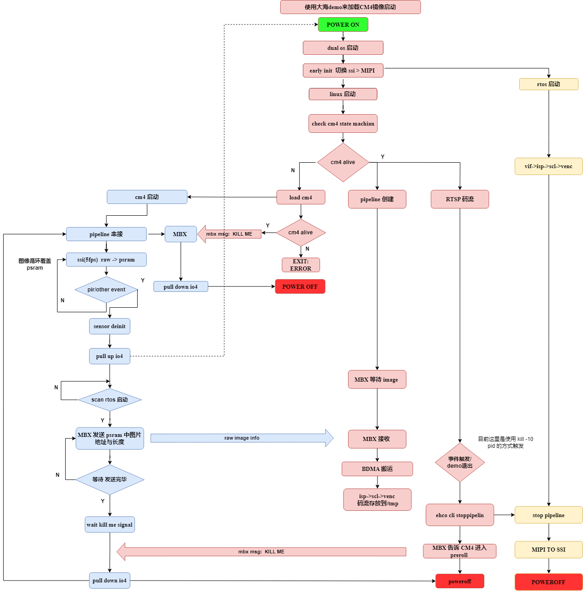
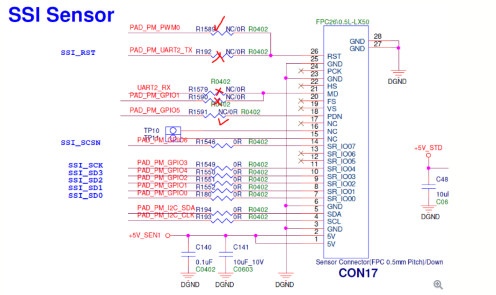
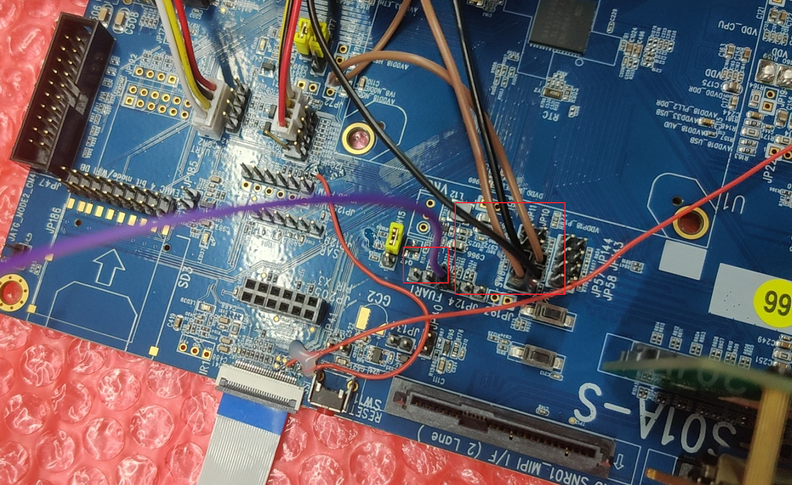

# NONPM_demo使用说明

---
## 一、demo场景

* 场景介绍： CM4 端 SSI pipeline 输出图像保存到psram 中，外部 pir 事件触发， CM4 SSI pipeline 退出，唤醒大海，大海启动rtos 串接MIPI pipeline，linux 启动之后运行demo创建rtsp推流，同时接收并编码 CM4 端 psram中保存的图像数据保存到板端 /tmp 目录，Linux 处理完成后，发送kill me 信号到CM4,CM4 端 SSI pipeline 启动，重读上述流程。

    ```
    CM4 pipeline : vif->psram
    +-------+
    |  VIF  +----------->+  psram
    +-------+

    rtos pipeline
    +-------+  framemode +-------+  realtime  +-------+ framemode  +-------+
    |  VIF  +----------->+  ISP  +----------->+  SCL  |+----------->+ VENC  |
    +-------+            +-------+            +-------+            +-------+

    linux pipeline
     user inject +-------+  realtime  +-------+  framemode  +-------+
     +----------->+  ISP  +----------->+  SCL  |+----------->+ VENC  |
                 +-------+            +-------+             +-------+

    绑定模式：isp->scl为 realtime、其它为framemode
    ```

**demo 流程如下**




---
## 二、编译环境说明
1. 在project路径下使用（nand，lpddr）选择deconfig进行整包编译;

    `SSC029B-S01A-S`型号板子，使用NAND，lpddr的配置,使用以下deconfig,其他板子型号详细参考用户手册

    config：`ipc-rtos_iford.spinand.glibc-11.1.0-ramdisk.ssc029b.256.bga11_lpddr4x_mipi_ssi_switch_defconfig`，

    在project目录执行以下命令进行编译;

    `make 所选场景_deconfig;`
    `make clean && make image -j8`

2. 进到sample_code目录执行`make clean && make source/iford/cm4/preload/linux/cm4_preload`进行编译;

3. 到`sample_code/out/arm/app/prog_cm4_preload_linux_cm4_preload`获取可执行文件;

---
## 三、运行环境说明
* 场景1板端环境：

    在`SSM000A-S01A-S`型号板子在` COM17（ssi）`以及 ` COM3（MIPI）`外接同一颗 `PS5416`型号sensor 的 SSI/MIPI 接口;

    COM17 请按照下图找所在地的CAE进行rework
    

    请按照下图调整板子跳线帽

    
    跳线时请 **特别注意 JP8/9 的接法，JP124 第三个 IO 是用于模拟 CM4 端 pir 事件的产生，默认启动悬空，需要时将其接地即可**

    

---
## 四、运行说明
将可执行文件 prog_cm4_preload_linux_cm4_preload放到板子上，修改权限为777

1. 按`./prog_cm4_preload_linux_cm4_preload file x cm4 x rtsp x`运行场景；

   > 按`./prog_cm4_preload_linux_cm4_preload file x cm4 x`运行，
   > 1. file x: x=0/1,not save/save raw file to /tmp；
   > 2. cm4 x: x=0/1,Whether to accept CM4 side images；
   > 3. rtsp x: x=0/1,Whether to pull out large resolution bitstream；

2. 使用`kill -10 pid`命令可关闭demo 发送 kill me 信号到 CM4 的功能；

---
## 五、运行结果说明
1. 根据输入参数 file 与 rtsp 对应检查是否有 rtsp 码流网略链接以及板端 /tmp 目录下是否有 raw/es 文件生成

2. 退出命令

   使用 kill -10 pid 可正常退出demo

---
