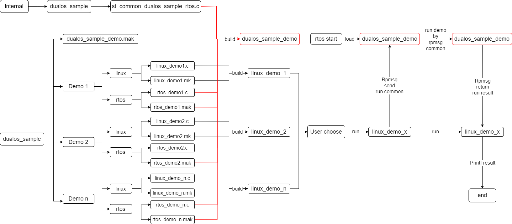

# dualos_sample_demo使用说明

---

## 一、背景介绍

此demo基于rpmsg(Dualos下rtos与linux通信机制)搭建框架。该目录demo主要用于测试dualos系统下相关模块在rtos端或者双端（linux+rtos）的功能。

## 二、框架说明

1. dualos_sample目录下每个module各自为一个文件夹，module文件夹下主要是每个module对应需要实现的功能demo，这里面包含Linux demo以及rtos demo。
2. 所有的rtos demo在最后都会通过接口`DUALOS_SAMPLE_MODULE_AUTO_INITCALLBACK`以回调注册的形式，汇总到dualos_sample中编译成一个demo，在rtos启动的时候启动此demo。
3. 运行Linux demo时，在linux demo中调用`START_RTOS_DEMO`接口，把当前运行demo的MODULE_NAME发送给rtos端，rtos端解析参数之后则会自动跳转到相应的rtos demo函数中执行相关的功能
4. rtos端的rpmsg通讯，以及每个module的callback初始化的动作实现在internal/dualos_sample_manager/rtos/st_common_dualos_sample_rtos.c。linux端调用的`START_RTOS_DEMO`等接口实现在internal/dualos_sample_manager/rtos/st_common_dualos_sample.c。



## 三、增加Module

1. 目录搭建
   
   ```
   └── module_xxx
       ├── linux
       │   ├── dep.mk
       │   ├── linux.mk
       │   ├── module__xxx_sample_linux.c
       └── rtos
           ├── pub
           │   └── module_xxx_sample_rtos.h
           ├── rtos.mak
           └── src
               └── module_xxx_sample_rtos.c
   ```
   
   注意：
   
   - 需要在dualos_sample_demo.mak中添加
     
     ```
     include $(PATH_dualos_sample_demo)/module/rtos/module_xxx.mak
     ```
   
   - mk.mak文件内容具体参考rpmsg

2. 示例
   
   Rtos端示例
   
   ```
   #define MODULE_NAME "MODULE_XXX"
   int ST_MODULE_XXX_Main(int menu_argc, char** menu_argv)
   {
       //just do samething
       return 0;
   }
   
   DUALOS_SAMPLE_MODULE_AUTO_INITCALLBACK(MODULE_NAME, ST_MODULE_XXX_Main)
   ```
   
   Linux端示例
   
   ```
   #define COMMON "MODULE_XXX test 1"
   int main(int argc, char **argv)
   {
       char                          send_common[128]  = {COMMON};
       //just do samething
       START_RTOS_DEMO(send_common);
       STOP_RTOS_DEMO();
       return 0;
   }
   ```
   
   注意：
   
   - 请确保Rtos端的MODULE_NAME和Linux端的COMMON中以空格为分隔的第一个参数相同，以完成匹配运行。
   - Linux端的COMMON的所有内容将以透传的方式给到Rtos端的char** menu_argv。
   - 本框架主要靠Linux下的`DUALOS_SAMPLE_MODULE_AUTO_INITCALLBACK`接口以及rtos下的`START_RTOS_DEMO`实现运行Linux demo自动调用对应rtos的功能。如果不使用本框架的话，去掉这两个接口单独把demo拿出去也是可以单独跑的。

---