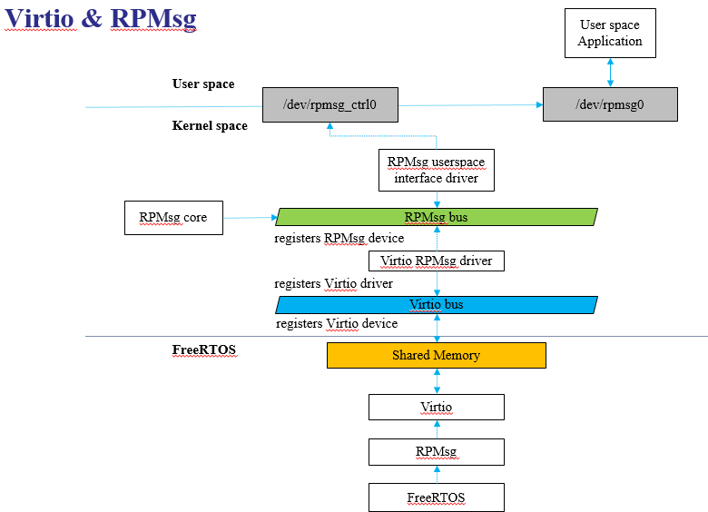
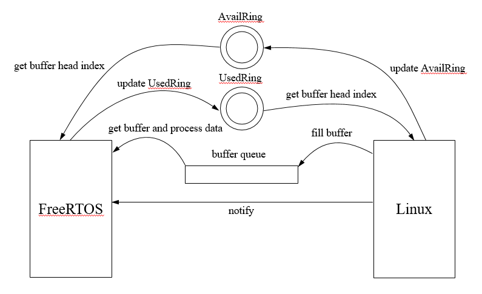
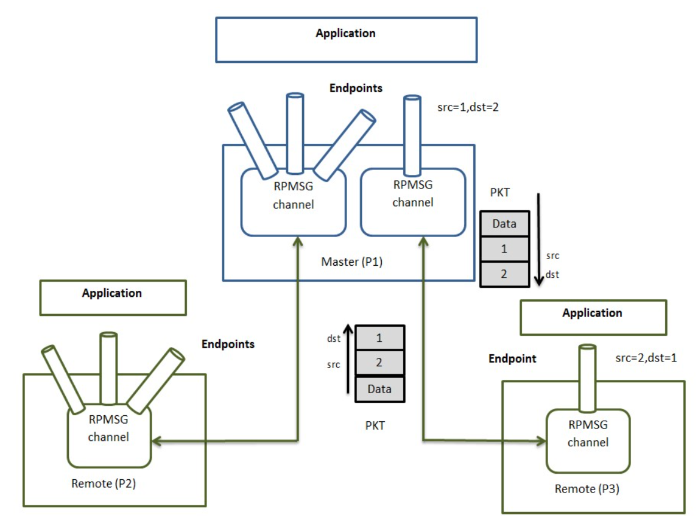
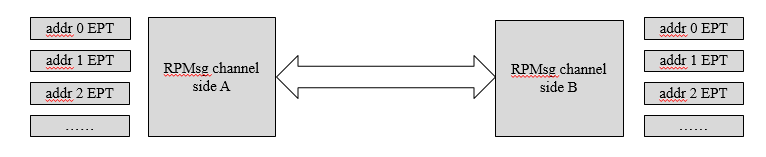

# rpmsg_demo使用说明

---
## 一、Rpmsg介绍
#### 1.1. Rpmsg概念

Rpmsg是一种开放式的processors之间、SoCs之间的通信协议。Linux Kernel内置了Rpmsg协议的实现，而FreeRTOS用的是RPMsg-Lite。

Rpmsg是一种通信协议，本身不提供Linux和FreeRTOS之间数据交换的具体实现。它需要依赖于Virtio来完成数据交换。

Virtio是为了提升虚拟化环境下的I/O性能而提出的一套半虚拟化解决方案。Virtio是一种前后端架构，包括前端驱动、后端设备、传输协议。在DualOS中，Linux Kernel作为前端驱动角色，FreeRTOS作为后端设备角色，Virtio通过共享内存在Linux和FreeRTOS之间进行数据传输，其中共享内存区域被称作vring。

#### 1.2. Rpmsg软件架构

<b>Rpmsg架构图</b>



如上图可以看到软件结构基本分为三层。FreeRTOS、Linux KERNEL和Linux USER层透过Rpmsg交互，下面简单介绍Linux通过Virtio向FreeRTOS发送数据（这部分对于用户来讲时无感的）的流程如下。

#### 1.3. Rpmsg通信流程

<b>Rpmsg通信图</b>



1. get buffer head index (Linux): 可以理解为下一次Linux写数据的地方

2. fill buffer: linux填充buffer(可以理解成Linux端申请的一块buffer)

3. update AvaliRing: Linux端写ring buffer地方

4. notify：Linux通知FreeRTOS

5. get buffer head index(FreeRTOS)：FreeRTOS写数据的地方
6. get buffer and process data ：数据传输，从buffer queue get buffer

7. update UsedRing：FreeRTOS更新数据，表示这个地方已经有数据了，Linux可以获取

8. buffer queue（共享内存）

#### 1.4. Rpmsg通信实例

**channel:** Rpmsg设备之间的通信通道。VirIO <-->VHost

**endpoint:** Rpmsg endpoint在Rpmsg channel之上提供逻辑连接，是发送数据的实体。它允许用户在同一个通道上绑定多个rx回调（即通过创建多个endpoint来达到该目标）。每个Rpmsg endpoint都有一个唯一的src地址和自定义的回调函数。当应用程序使用本地地址创建endpoint时，目标地址等于endpoint本地地址的所有后续数据都将路由到该回调函数。

**src:** 数据包的发送端endpoint地址。

**dst:** 数据包的接收端endpoint地址。

<b>Rpmsg通信示例图</b>



<b>Rpmsg endpoint</b>



channel两边收到Rpmsg格式的数据会依据其dst地址，分发给对应的endpoint，即调用创建该endpoint时注册的回调函数（callback）。channel两边的地址空间是独立的，因此两边可以使用同一个地址，互不干扰。但是相同一边的地址必须互不相同，否则会出现不知道把数据分发给谁的问题。

#### 1.5. Rpmsg注意事项

两边的数据分发是线性的，每一个数据包通过调用对应的callback函数进行分发，所以在设计应用时，要考虑endpoints间的相互影响，callback函数必须不能阻塞。标准的应用模式是callback里只把data放到一个队列（queue）后就返回，另一个实际的工作线程从队列里取数据进行后续处理。

---
## 二、编译环境说明
1. 例如`SSC029C-S01A-S`型号板子，使用nand，ddr3的配置,使用以下deconfig,其他板子型号详细参考用户手册

    `ipc-rtos_iford.spinand.glibc-11.1.0-ramdisk.ssz029c.256.qfn128_ddr3_defconfig`
    根据场景在project目录执行以下命令进行编译;

    `make ipc-rtos_iford.spinand.glibc-11.1.0-ramdisk.ssz029c.256.qfn128_ddr3_defconfig;`
    `make clean && make image -j8`

    > 注意：编译之前需要配置CONFIG_DUALOS_SAMPLE_DEMO，才能正常运行demo，可以进入alkaid/project目录下通过`make menuconfig`来配置，进入menuconfig界面之后通过以下路径打开此config：

    `Rtos->Rtos Application Options->Support pipeline demo applications->Support dualos_sample application`

2. 进到sample_code目录执行`make clean && make source/iford/dualos_sample/rpmsg/linux`进行编译;

3. 到`sample_code/out/arm/app/prog_dualos_sample_rpmsg_linux`获取可执行文件;

---
## 三、运行说明
1.将可执行文件`prog_dualos_sample_rpmsg_linux`放到板子上，修改权限777
2.查看`/misc/earlyinit_setting.json`中的"NAME"是否为dualos_sample，如果不是请做修改并reboot：

```
    "APP_0_0": {
        "NAME": "dualos_sample",
        "PARAM": ""
    }
```

> 按`./prog_dualos_sample_rpmsg_linux`运行demo
---